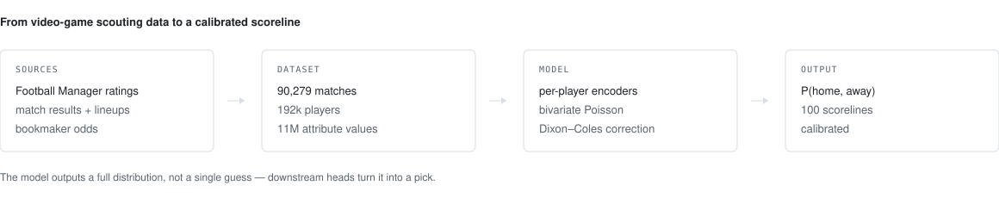

# goalnet-fm


<picture>
  <source media="(prefers-color-scheme: dark)" srcset="assets/pipeline-dark.svg">
  
</picture>

**Can a video game's scouting database predict real football scorelines?**

Football Manager employs a global network of over a thousand scouts and researchers who rate every professional player on
60+ attributes, 1–20, from *Finishing* and *Positioning* down to hidden traits like *Consistency*
and *Big Match Temperament*. It is, plausibly, the most detailed public model of football talent in
existence. This repo asks whether it can predict the **exact scoreline** of a real match — and then
spends six phases of controlled experiments finding out.

The short answer is the interesting part:

> **Yes — right up until you show the model the betting odds. After that, the Football Manager
> ratings add approximately nothing.**
>
> Confirmed on 104 World Cup 2026 games, then replicated on 214 held-out games across Euro 2024,
> Copa América 2024 and the Nations League. A model with the player ratings *deleted* scored as
> well or better on every one of those tournaments.

A project that disproves a good chunk of its own premise, and says so, is more useful than one that
quietly buries the null result. The evidence trail is in
[`experiments/ablation/DESIGN.md`](experiments/ablation/DESIGN.md) and
[`RESULTS_WC2026.md`](RESULTS_WC2026.md).

---

## What actually got built

A calibrated scoreline model — **GoalNet** — that outputs a full probability distribution over every
scoreline (0–0 through 9–9), not just win/draw/loss.

| | Score information¹ | RPS² | Exact hits (of 104) |
|---|---|---|---|
| Empirical-prior null (always pick the modal score) | 0.000 | — | 12 |
| Production v1 (points-chasing loss) | +0.130 | 0.157 | 14 |
| **Production v2 (calibrated + market)** | **+0.351** | **0.147** | 13 |

¹ nats of information over an empirical-prior null — how much the model knows beyond "1–0 is common".
² Ranked Probability Score, the standard football-forecasting metric; lower is better.

v2 **more than doubled** the information content of the shipped model. Two changes did all the work,
and neither of them was a fancier architecture.

---

## The three findings worth your time

**1. Deleting the "win more points" term from the loss was the single biggest gain.**
The original model was trained with a reward term for maximising fantasy points (exact score = 3,
right outcome = 1). It felt obviously correct. It was a bias: pure Poisson likelihood is a *proper
scoring rule*, minimised exactly when the model tells the truth. Bolting a payoff onto it drags the
model away from the truth. Removing it was worth **+0.15 information, for free**.

**2. Only genuinely new information ever moved the needle.**
Six phases of ideas that re-derived signal already present in the data came back null — Elo momentum
and form trajectory, cross-team attention (both early and late fusion), plus-minus player ratings,
in-tournament fine-tuning. The one lever that worked was **de-vigged bookmaker odds**: information
the dataset genuinely did not already contain.

**3. In-tournament fine-tuning fails, and it fails for a teachable reason.**
Updating the model on World Cup results as they arrived *destroyed* it — catastrophic forgetting of
69,000 matches of pretraining by roughly 100 new ones. Adding **L2-SP** (an L2 penalty toward the
pretrained weights; a small-model alternative to LoRA) fixed the forgetting and *still* lost to
simply leaving the model frozen. Sometimes the honest result is that a clever idea has nowhere to
get information from.

---

## What this project touches

Half the fun was that the problem refused to stay inside one discipline.

| Domain | What it meant here |
|---|---|
| **Data engineering** | 90,279 matches across 54 competitions; 192k players, 11M attribute values, 3.4M appearance rows in SQLite |
| **Entity resolution** | Clubs are `Ath Madrid` in one source and `Atlético de Madrid` in another; players share no IDs across sources. Matching runs on (competition, date ±2d, exact score) with name-similarity tie-breaks — never on names alone |
| **Reverse engineering** | OddsPortal serves odds through an encrypted AJAX endpoint. Recovering it meant pulling the client bundle, finding the PBKDF2 → AES-CBC → gzip chain, and reimplementing it in ~40 lines |
| **Applied statistics** | Shin's method for removing bookmaker margin; Dixon–Coles low-score correction; proper scoring rules; calibration (ECE, reliability curves) |
| **Deep learning** | Per-player attribute encoders → team representation → bivariate Poisson goal rates. PyTorch, CPU-only, ~150k parameters |
| **Experimental design** | A 35-run append-only registry, a frozen metric suite, pre-registered gates, and walk-forward leakage control |
| **Decision theory** | The model emits probabilities; separate *heads* turn them into bets under whatever scoring table a competition uses — including a Monte-Carlo bracket simulator for "who wins the cup" |
| **Market efficiency** | An accidental empirical lesson in why beating a liquid betting market with public data is hard |

---

## The methodology (the part I would actually defend)

Every claim above had to survive a deliberately hostile process:

- **A frozen metric suite.** Metric definitions were fixed *before* the experiments and never
  renegotiated — no moving goalposts when a favourite idea underperformed.
- **An append-only registry.** All 35 runs live in
  [`experiments/ablation/registry.jsonl`](experiments/ablation/registry.jsonl), including the
  embarrassing ones. Reports regenerate from it and are never hand-edited.
- **Pre-registered adopt/reject gates,** written down before results were seen.
- **Leakage taken seriously.** The World Cup 2026 slate was the *only* clean holdout — every earlier
  tournament sits inside the training window, so validating on those required retraining behind a
  time cutoff. The walk-forward replay rebuilds context matchday by matchday, and its correctness is
  checked by a tripwire that must reproduce the static evaluation exactly.
- **Null results published.** Phases 3 and 5 produced nothing shippable. They are documented at the
  same length as the wins, because knowing where the ceiling is has a cost and that cost was paid.

---

## Reproducing it

**Requirements:** Python 3.12, PyTorch (CPU is fine), NumPy, BeautifulSoup, `cryptography`. No GPU.

The database and trained checkpoints are **not** in this repo — the DB is large and holds scraped
third-party data, and the weights are regenerable. The scrapers rebuild both from public sources,
throttled and disk-cached, so re-runs are free and resumable.

```bash
# 1. Build the match / player database (long; throttled and resumable)
python src/load_matches.py            # results, odds columns, xG
python src/scrape_fminside.py         # Football Manager attribute snapshots
python src/load_lineups_espn.py       # starting XIs

# 2. Build model inputs
python src/build_player_dataset_imp.py --max-imp 1   # -> data/players_imp.npz
python src/build_context.py                          # -> data/context.npz   (Elo, form, rest days)
python src/scrape_oddsportal.py                      # -> data/oddsportal_raw.csv
python src/build_odds_feat.py                        # -> data/ctx_odds.npz  (Shin de-vigged)

# 3. Train the production model (beta=0, W=1, market feature, 5-seed ensemble)
python src/train_goals.py --full --odds --ensemble 5

# 4. Predict a fixture
python src/predict_game.py NED-SWE
```

Re-running the experiments:

```bash
python experiments/ablation/run_ablation.py --name my-run --beta 0 --w 1 --seeds 5
python experiments/ablation/run_ablation.py --report        # regenerate the results table
python experiments/ablation/replay_wc.py --seeds 3          # walk-forward tournament replay
python experiments/ablation/backtest_tournaments.py         # leakage-free multi-tournament backtest
python experiments/ablation/tripwire_v2.py data/goalnet.pt  # score any checkpoint on the WC slate
```

Running the bots (they auto-fill picks in fantasy leagues I play in). Credentials are never stored
in the repo — export your own session values first:

```bash
export FANTASY_ANON_KEY="<the app's public anon key, from your own browser session>"
export FANTASY_BASE_URL="<the app's API base URL>"
python auto_bet.py
```

---

## Repo map

```
src/                        96 scripts: scrapers, dataset builders, training, inference
  train_goals.py            the production model and training loop
  predict_game.py           inference + pick strategies (chalk / exacts / contrarian / gamble)
  scrape_oddsportal.py      the reverse-engineered encrypted odds endpoint
  build_odds_feat.py        Shin de-vigging -> model features
experiments/ablation/       the experiment harness
  DESIGN.md                 frozen contracts and every phase verdict   <- start here
  registry.jsonl            all 35 runs, append-only
  replay_wc.py              walk-forward tournament replay
  backtest_tournaments.py   leakage-free multi-tournament backtest
RESULTS_WC2026.md           the narrative results log
LITERATURE.md               prior work and what it implied for the design
FUTURE_WORK.md              what comes next, and why
```

---

## What I would do next

The finding that odds dominate reframes where effort belongs; it does not end the project.

- **Where odds do not exist** — lower divisions, minor internationals, fixtures before the market
  opens — the FM ratings are the only signal available. That is where they earn their keep, and
  54% of the database has no odds at all.
- **Per-player prediction** (goals, assists, fantasy points) is the frontier a betting market does
  not price game by game. It needs per-player event data the database does not yet hold.
- **A pre-kickoff prediction log** is the real fix for the evaluation problem: log every prediction
  before kickoff, grade it after, and a permanently leakage-free benchmark accumulates itself, with
  no cutoff retraining required.

---

## Notes and caveats

- **Odds come from a single aggregator** (a ~7-bookmaker consensus average, Shin de-vigged), so
  there is no cross-provider redundancy.
- **Sample sizes are small where it counts.** One tournament is ~104 games; differences of a few
  points or a handful of exact scores are noise, and are labelled as such throughout.
- **Scraped data is not redistributed here.** The scrapers are throttled and cached; please be
  considerate of the sources if you run them.
- **Nothing here is betting advice.** The most robust finding in the entire repo is that the market
  is very hard to beat.

Built by [@dkreinov](https://github.com/dkreinov) · MIT licensed
